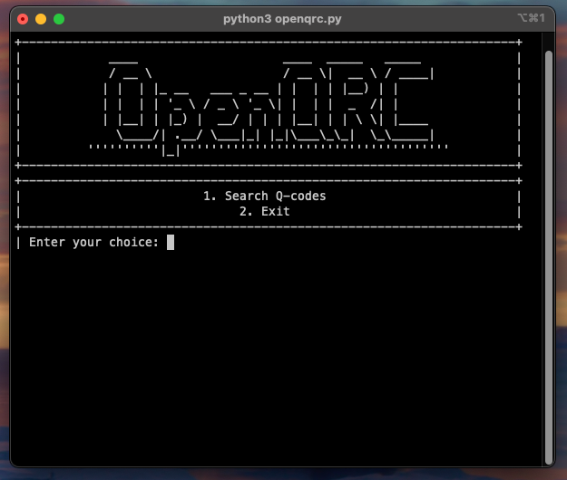

# OpenQRC - The Open Source Q-Code Reference for Ham Radio

## About OpenQRC
OpenQRC is a community-driven project aiming to create a comprehensive, open-source reference for Q-codes used in amateur (ham) radio communications. Our goal is to provide an easily accessible guide that supports both new and experienced ham radio enthusiasts in their daily communications and learning.

## Features
- **Comprehensive Q-Code Listings:** Detailed descriptions, mnemonics, and examples for each Q-code.
- **Community Contributions:** A platform for ham radio operators worldwide to contribute and share their knowledge.
- **Future Development:** Plans include creating an online tool and developing cross-platform software for Windows, macOS, and Linux to enhance accessibility and usability.

## How to Use
OpenQRC is currently only available as a python script. To use it, follow these instructions:

1. **Ensure you have python 3 installed:** OpenQRC requires python 3.6 or later. You can check your version by running `python --version` in your terminal.
2. **Download and install OpenQRC:**
- Open your terminal
- Run the following command:
`curl -o- https://raw.githubusercontent.com/yourusername/yourprojectname/main/install.sh | bash`
3. **Run OpenQRC:**
- Go to the OpenQRC directory:`cd ~/OpenQRC`
- Run OpenQRC: `python3 openqrc.py`

## Planned Features
- **Online Tool:** An interactive website for easy searching, learning, and referencing of Q-codes.
- **Software Tool:** Cross-platform applications to provide a comprehensive Q-code reference tool accessible offline for Windows, macOS, and Linux users.

## How to Contribute
We welcome contributions from the community. Whether it's adding new Q-codes, refining existing entries, or contributing to the development of our planned tools, your input is invaluable.

1. **Fork** the repository.
2. **Create** your feature branch (`git checkout -b feature/AmazingFeature`).
3. **Commit** your changes (`git commit -am 'Add some AmazingFeature'`).
4. **Push** to the branch (`git push origin feature/AmazingFeature`).
5. **Submit** a Pull Request.

For more details, please refer to [CONTRIBUTING.md](CONTRIBUTING.md).

## Acknowledgments
A heartfelt thank you to all contributors and the ham radio community for sharing their knowledge and experience, making this project possible.

## License
This project is licensed under the GNU General Public License v3.0. For more details, see the [LICENSE](LICENSE) file.
